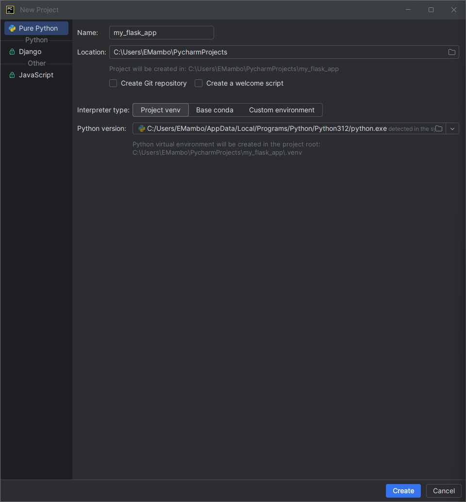
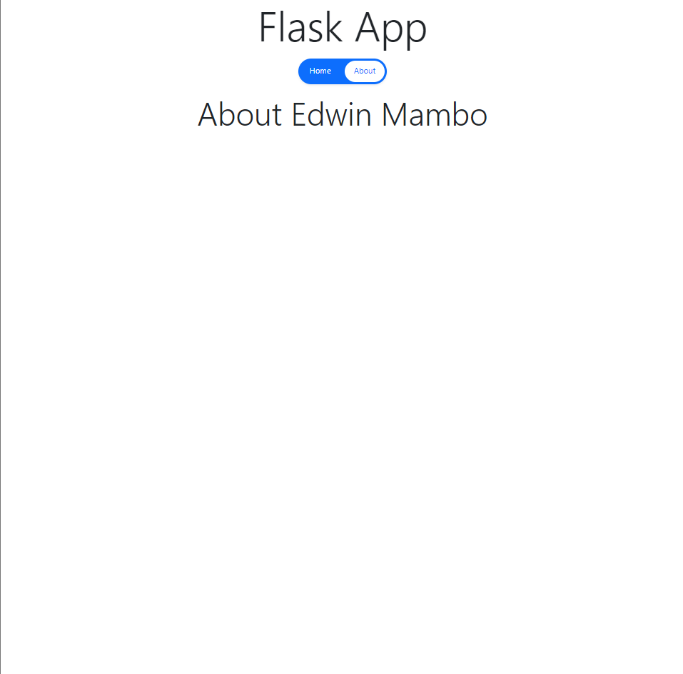

# Flask Installation and Simple Webpage Guide in PyCharm

## Prerequisites
Ensure that you have the following installed on your machine:
- **Python**: Check if Python is installed by running in your terminal:
  ```bash
  python --version
  ```
  If it's not installed, download it from [here](https://www.python.org/downloads/).

- **PyCharm**: Download and install PyCharm from [here](https://www.jetbrains.com/pycharm/download/).

**Note**: _The following steps are specific to PyCharm, but you can adapt them to other IDEs or text editors. See the versions used for this tutorial:_
- **Python**: 3.12.5
- **PyCharm**: 2024.2.3 (Community Edition)


## Step 1: Create a New Project in PyCharm
1. Open **PyCharm**.
2. Click on **New Project**.
3. Choose **Pure Python** from the left sidebar.
4. Set your project **Name** (e.g., `my_flask_app`) and location (e.g., `~/usr/<username>/PycharmProjects`).
5. Tick the box that says **Create Git Repository** if you want to use version control (optional).
6. Select the **Project venv** option for **Interpreter type** so that it uses a virtual environment (the default option).
8. Select the **Python version** you want to use (usually the default one detected in the system).
9. Click **Create**.

   

## Step 2: Project Directories and Files
1. Right-click on the project root (`my_flask_app`).
2. Select **New > Directory** and create a folder named `app`.

3. Create a new Python file in the project root (`my_flask_app`) directory named `app.py`. (Right-click on the project root and select **New > Python File**). This file will be the entry point for our Flask application.

4. The file opens in the editor on the right. Let's edit the file with the following code:

    ```python
    from app import app

    if __name__ == '__main__':
        app.run(debug=True)
    ```
    _Realize that the app after import is underlined with red squiggly lines because it doesn't know how to import from the app directory yet. Lets fix that below._

5. Create a new Python file in the `app` directory named `__init__.py`. This is a special file that tells Python that the `app` directory should be treated as a package. This will initialize the Flask application.

6.  Add the following code to the `__init__.py` file:

    ```python
    from flask import Flask
    ```
    _You will realize some squiggly lines under Flask because it doesn't know where to import it from. Let's fix that below._

## Step 3: Installing Flask
1. Open the **Python Packages** in PyCharm (usually located at the bottom left panel of the window).

_Only pip in installed. We need to install Flask._

2. Open the terminal in PyCharm (usually located at the bottom of the window). Ensure your virtual environment is activated. You should see the name of your virtual environment in the terminal prompt.

    ```bash
    (.venv) ~\PycharmProjects\my_flask_app
    ```
3. Install Flask by running the following command:
   ```bash
   pip install flask
   ```

4. Once Flask is installed, you should see it and its dependencies listed in the Python Packages section alongside `pip`:
   - `MarkupSafe`
   - `itsdangerous`
   - `colorama`
   - `blinker`
   - `Werkzeug`
   - `Jinja2`
   - `click`
   - `flask`

    _Realize that the squiggly lines under Flask and app have disappeared because PyCharm now recognizes the Flask package._

5. Create a new Python file in the `app` directory named `app_factory.py`. This file will contain the function to create the Flask application instance. It will also import the `app` instance from the `__init__.py` file.
It will serve as a workaround to the circular import and redundancy issue that arises when importing the `app` instance in the `app.py` file. Write the following code in the `app_factory.py` file:

    ```python
    from flask import Flask

    def create_app():
        app = Flask(__name__)
        return app
    ```

6. In the `__init__.py` file, import the `create_app` function from the `app_factory.py` file and create the `app` instance:

    ```python
    from .app_factory import create_app

    app = create_app()
    ```
    _This should start our app._


## Step 4: Working with Routes and Templates
We will create the routes and templates for our application. We will start with routes - this is like the brain of our application.

1. Right-click on the `app` directory and create a new directory named `routes.py`. This file will contain the routes for our application. Have the below code in the `routes.py` file:

    ```python
    from flask import render_template
    from . import app

    @app.route('/')
    def index():
        return render_template('index.html')
    ```

2. Create a new directory in the `app` directory named `templates`. This directory will contain the HTML templates for our application.
   1. Right-click on the project root (`my_flask_app`).
   2. Select **New > Directory** and create a folder named `templates`.

3. Inside the `templates` folder, create a new HTML file named `index.html`. This file will be the homepage of our application. Add the following code:

   ```html
    <!DOCTYPE html>
    <html lang="en">
    <head>
        <meta charset="UTF-8">
        <title>Your Name</title>
    </head>
    <body>
        <h1>Welcome to Your Name's Website</h1>
    </body>
    </html>
    ```
    _Replace `Your Name` with your name._

4. In the `__init__.py` file, import the `routes` module to register the routes with the Flask application:

    ```python
    from . import routes
    ```

5. Let's also add a secret key to the `app` instance in the `__init__.py` file. This is used to keep the client-side sessions secure. Add the following line to the `app` instance in the `__init__.py` file:

    ```python
    app.secret_key = 'your_secret_key'
    ```
    _Replace `your_secret_key` with an environment variable of your choice. _

## Step 5: Running the Application
Here's how we will run this application:

1. Open the terminal in PyCharm.
2. Ensure your virtual environment is activated.
3. Run the following command to start the Flask development server:

    ```bash
    python app.py
    ```
    You should see the following output:

    ```ps
    * Serving Flask app 'app.app_factory'
    * Debug mode: on
    WARNING: This is a development server. Do not use it in a production deployment. Use a production WSGI server instead.
    * Running on http://127.0.0.1:5000
    Press CTRL+C to quit
    * Restarting with stat
    * Debugger is active!
    * Debugger PIN: 123-456-789
    ```

    _Anything done on the website will show up here._

4. Open your browser and navigate to `http://127.0.0.1:5000/` to view your website.

5. Make some changes to the website. The change will reflect since this is development server.

   1. Open `index.html` and change the `<h1>` element to `<h1>Welcome to Your Name's Best Website</h1>`

   2. Go to the webpage and refresh the page.

   3. The new content should appear. The activity should also be displayed in your terminal as well.

## Step 6: Working with Static Files
To add static files like pictures, here's what to do:

1. Right Click on the `app` directory and create a new directory named `static`. This directory will contain the static files for our application.

2. Inside the `static` folder, create a new directory named `assets`. This directory will contain the images for our application.

3. Add an image to the `assets` directory. You can download an image from the internet or use any image you have on your computer.

4. In the `index.html` file, add the following code to display the image:

    ```html
    <!DOCTYPE html>
    <html lang="en">
    <head>
        <meta charset="UTF-8">
        <title>Your Name</title>
    </head>
    <body>
        <h1>Welcome to Your Name's Website</h1>
        
    </body>
    </html>
    ```
    _Replace `image.jpg` with the name of the image you added to the `assets` directory._

5. Run the application again by running the `app.py` file or refresh your browser if the server is still running.

    The image should be displayed on the homepage of your website.

6. Let's make the image smaller by changing the line in `index.html` to the below:

    ```html
    
    ```
    _The image should now be smaller._

### (Optional) Git Version Control
If you hadn't initialized a Git repository when creating the project, you can do so now(In Pycharm).

1. Click on the **VCS** menu on the top bar.
2. Select **Enable Version Control Integration...**.
3. In the dialog that appears, select **Git** from the list of version control systems and click **OK**.
4. You should see the Git icon on the top right corner of the PyCharm window, just below the project folder icon.

   

    If you had initialized a Git repository when creating the project, you can commit your changes by following these steps:

5. Right-click on the project root and select **Git > Add** to add all the files to the staging area.

6. Open the **Commit Changes** dialog by clicking on the **Commit** icon on the top right corner of the PyCharm window just below the project folder icon.

7. Select on the changes checkbox that appears to select files. In the **Commit Changes** panel that appears, enter a commit message and click **Commit**.
You can also click on the **Commit and Push** button to push the changes to a remote repository if you had connected to one. If you hadn't, you can do so by:

   1. Click on the **VCS** / **Git** menu on the top bar.

   2. Select **Github > Share Project on Github**

   3. Follow the prompts to connect to your Github account and create a new repository if you hadn't connected. If you had, then proceed.

   4. Enter the repository name and description (optional) and click **Share**. Untick `private` if you want the repository to be public.

    


## Step 7: Adding different pages

We want to add different pages that can be navigated to.

1. Add the following to the `routes.py` file:

    ```python
    @app.route('/about')
    def about():
        return render_template('about.html')
    ```

2. Create a new HTML file in the `templates` directory named `about.html`. Add the following content to the file:

    ```html
    <!DOCTYPE html>
    <html lang="en">
    <head>
        <meta charset="UTF-8">
        <title>About</title>
    </head>
    <body>
        <h1>About Me</h1>
    </body>
    </html>
    ```

3. Let's take a step further and add `base.html` to the `templates` directory. This file will contain the common elements of all the pages. Add the following content to the file:

   ```html
    <!DOCTYPE html>
    <html lang="en">
    <head>
        <meta charset="UTF-8">
        <title>Flask Example</title>
    </head>
    <body>
        
    </body>
    </html>
   ```

4. Update the `index.html` and `about.html` files to extend the `base.html` file. Replace the content of the `index.html` file with the following:

    ```html
    

    
    <h1>Welcome to Your Name's Website</h1>
    
    
    ```

    Replace the content of the `about.html` file with the following:

    ```html
    

    
    <h1>About Me</h1>
    
    ```

   If you refresh the page in the browser, it will still work. See the change in the tab title. It picks the `base.html` title.

   If you navigate to `http://127.0.0.1:5000/about`, you should see the content of the `about.html` file.

5. Let's add navigation links to the `base.html` file. Update the `base.html` file with the following content:

    _(You can use Copilot in PyCharm to generate the code)_

    ```html
    <!DOCTYPE html>
    <html lang="en">
    <head>
        <meta charset="UTF-8">
        <title>Flask Example</title>
    </head>
    <body>
        <nav>
            <a href="{{ url_for('index') }}">Home</a> |
            <a href="{{ url_for('about') }}">About</a>
        </nav>
        
    </body>
    </html>
    ```
    _The navigation links should now appear on all pages._

6. Let's give the application a basic bootstrap look. We will use Bootstrap 5 (currently v5.3 as at the writing of this walkthrough). See here for more information: [Latest Bootstrap](https://getbootstrap.com/)

    Change the `base.html` file to the following:

    ```html
    <!DOCTYPE html>
    <html lang="en" xmlns="http://www.w3.org/1999/html">
    <head>
        <meta charset="UTF-8">
        <title>Flask Example</title>
        <link href="https://cdn.jsdelivr.net/npm/bootstrap@5.3.3/dist/css/bootstrap.min.css" rel="stylesheet" integrity="sha384-QWTKZyjpPEjISv5WaRU9OFeRpok6YctnYmDr5pNlyT2bRjXh0JMhjY6hW+ALEwIH" crossorigin="anonymous">
    </head>
    <body class="container">
        <header>
            <!-- Brand Name -->
            <h1 class="text-center m-0 display-2">Flask App</h1>

            <!-- Navigation Menu -->
            <nav class="d-flex justify-content-center py-3">
                <ul class="nav nav-pills nav-fill gap-2 p-1 small bg-primary rounded-5 shadow-sm" id="pillNav2" role="tablist" style="--bs-nav-link-color: var(--bs-white); --bs-nav-pills-link-active-color: var(--bs-primary); --bs-nav-pills-link-active-bg: var(--bs-white);">
                    <li class="nav-item" role="presentation">
                        <a class="nav-link active rounded-5" id="home-tab" href="{{ url_for('index') }}" role="tab" aria-selected="true">Home</a>
                    </li>
                    <li class="nav-item" role="presentation">
                        <a class="nav-link active rounded-5" id="about-tab" href="{{ url_for('about') }}" role="tab" aria-selected="false">About</a>
                    </li>
                </ul>
            </nav>
        </header>

        <!-- Flask dynamically loads the page content -->
        <main class="row justify-content-center">
            
            
        </main>

        <script src="https://cdn.jsdelivr.net/npm/bootstrap@5.3.3/dist/js/bootstrap.bundle.min.js" integrity="sha384-YvpcrYf0tY3lHB60NNkmXc5s9fDVZLESaAA55NDzOxhy9GkcIdslK1eN7N6jIeHz" crossorigin="anonymous"></script>
    </body>
    </html>
    ```

    _`active` has been added for extra functionality required in bootstrap theme used. (A little advanced)_

    Your `index.html` and `about.html` should be like the following:

    `index.html`
    ```html
    

    
    <h2 class="text-center display-4">Welcome to Your Name's Website</h2>
    
    
    ```

    `about.html`
    ```html
    

    
    <h2 class="text-center display-4">About Your Name</h2>
    
    ```

    Your webpage should have a look similar to the ones below:

    Home/Index Page
    
    About Page
    

7. You can now commit your changes to Git and push your changes to GitHub if you have it set up.

    _You can also add more pages and styles to your application._

## Conclusion
You have successfully created a simple Flask application with multiple pages and a basic Bootstrap theme. You can now build on this foundation to create more complex web applications using Flask.

_This is a basic guide to get you started with Flask. You can explore more features and functionalities of Flask to build more advanced web applications._

You can find this example in this [repository](https://github.com/edwinmambo/my_flask_app/)

Happy coding! 🚀
